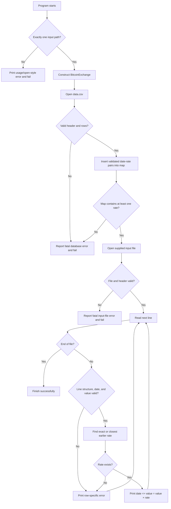

# Bitcoin Exchange (C++ Module 09, ex00)

## Development Blueprint — C++98, code-free design

## 1. Mission and non-negotiable constraints

Build a program named `btc` that:

1. Loads the historical Bitcoin exchange-rate database from `data.csv`.
2. Accepts exactly one command-line argument: the path to an input file.
3. Reads that input file one line at a time in the form `date | value`.
4. Validates each line independently.
5. Multiplies the value by the rate for the requested date, or by the rate from the closest earlier database date.
6. Reports a bad line and continues processing all remaining lines.

Design constraints:

- Language standard: C++98 only.
- Sole STL container: `std::map<std::string, float>`.
- No C++11 conversion helpers, regular expressions, `auto`, range-based loops, or other post-C++98 features.
- No function implementation in the header.
- No `using namespace` or `friend`.
- The main class follows the Orthodox Canonical Form.
- Compilation uses `c++ -Wall -Wextra -Werror -std=c++98`.
- Required files: `Makefile`, `main.cpp`, `BitcoinExchange.hpp`, and `BitcoinExchange.cpp`.

Why `std::map` is appropriate: it stores one rate per unique date, maintains dates in sorted order, provides logarithmic lookup, and exposes `lower_bound()`. Because valid dates use fixed-width `YYYY-MM-DD`, lexicographic string order is also chronological order.

---

## 2. Responsibility boundaries

Keep `main` deliberately small. It should verify the argument count, create the exchange object, initiate database loading and input processing, and translate fatal startup failures into a nonzero exit status. Parsing, validation, lookup, and line-level reporting belong to `BitcoinExchange`.

The class owns only one persistent data structure:

| Member | Type | Responsibility |
|---|---|---|
| `_rates` | `std::map<std::string, float>` | Stores `date -> exchange rate`, automatically sorted by date. |

Do not store all input rows. Process each input line immediately, print its result or error, then discard its temporary strings and numeric value. This meets the “on the fly” requirement and keeps memory usage independent of the input-file size.

---

## 3. Class architecture

### Public interface

| Method | Expected input | Output | Exact purpose |
|---|---|---|---|
| `BitcoinExchange()` | None | Constructed object | Creates an object with an empty rate map. It does not silently process an input file. |
| `BitcoinExchange(const BitcoinExchange &other)` | Existing exchange object | Constructed copy | Copies the complete database state from `other`. |
| `operator=(const BitcoinExchange &other)` | Existing exchange object | Reference to the current object | Handles self-assignment and copies the rate map. |
| `~BitcoinExchange()` | None | None | Performs normal cleanup. The map owns its elements, so no manual deletion is needed. |
| `loadDatabase(const std::string &path)` | Database path, normally `data.csv` | Prefer `void` with a fatal exception, or consistently use `bool` | Opens and validates the CSV database, then populates `_rates`. Failure is fatal because calculations cannot be trusted without rates. |
| `processInputFile(const std::string &path) const` | User-provided file path | Prefer `void` with a fatal open exception | Verifies the input header, reads subsequent rows one at a time, and sends every row through the validation/calculation pipeline. |

### Private helpers

| Method | Expected input | Output | Exact purpose |
|---|---|---|---|
| `processLine(const std::string &line) const` | One raw input row | `void` | Coordinates delimiter parsing, trimming, date validation, numeric conversion, bounds checking, lookup, and output. A row failure is handled here without terminating the file loop. |
| `isValidDate(const std::string &date) const` | Candidate date text | `bool` | Confirms exact shape and a real Gregorian calendar date, including leap-year rules. |
| `parseNumber(const std::string &text, float &result) const` | Candidate numeric token and output reference | `bool` | Performs C++98 numeric conversion and proves the entire token was consumed; rejects empty, partial, malformed, and non-finite-like spellings. |
| `isValidValue(float value) const` | Parsed input amount | `bool` | Confirms the amount lies in the inclusive interval `0` through `1000`. Error selection may distinguish negative from too large. |
| `isValidRate(float rate) const` | Parsed database rate | `bool` | Confirms a database rate is nonnegative and acceptable for multiplication. It must not apply the input-only upper bound of `1000`. |
| `getRate(const std::string &date) const` | Already validated date | `float` | Returns the exact-date rate or the closest earlier rate using `lower_bound()`. Signals that no earlier database record exists. |
| `trim(const std::string &text) const` | Raw token | `std::string` | Removes permitted leading and trailing whitespace without changing internal characters. Implement manually with string indices in C++98. |
| `isLeapYear(int year) const` | Parsed year | `bool` | Applies the Gregorian divisibility rule used by February validation. |
| `daysInMonth(int year, int month) const` | Parsed year and month | `int` | Returns the legal maximum day, including 29 for February in leap years. |

### Design decision: exceptions versus booleans

Use two error levels consistently:

- **Fatal errors:** wrong argument count, database cannot open, invalid/corrupt database, input file cannot open, or unusable database. These stop the program.
- **Recoverable row errors:** malformed delimiter, invalid date, invalid value, or date earlier than the first known rate. These print one error and return to the file loop.

Do not let a recoverable row error escape far enough to terminate `processInputFile()`.

---

## 4. File formats and parsing contracts

### Historical database

- Expected header: `date,exchange_rate`.
- Each later nonempty row must contain exactly one comma.
- Left token: valid date.
- Right token: fully valid nonnegative number.
- Duplicate dates need a deliberate rule. The safest strict policy is to reject the database as corrupt; silently overwriting can hide bad source data.
- After loading, `_rates` must not be empty.

The database is trusted as project-supplied data only after structural validation. Validating it prevents undefined application behavior if the file is missing or damaged.

### User input

- Expected header: `date | value` after a clearly defined trimming policy.
- Each data row must contain exactly one `|` delimiter.
- Split only after proving the delimiter occurs exactly once.
- Trim both tokens.
- Neither token may be empty.
- Validate the date before looking it up.
- Convert and validate the amount before multiplying.
- Preserve the original line for `Error: bad input => ...` messages.

Avoid extracting `date`, separator, and value with ordinary whitespace tokenization alone. That strategy can accidentally accept trailing garbage or malformed separators.

---

## 5. Execution flow

### 5.1 Complete visual execution trace

```text
USER RUNS PROGRAM
      │
      │  ./btc input.txt
      ▼
┌──────────────────────────────────────────────────────────────┐
│  PROGRAM START                                               │
│                                                              │
│  argc           = ?                                          │
│  inputFilePath  = not selected yet                           │
│  exchange._rates = empty map                                 │
└─────────────────────────────┬────────────────────────────────┘
                              │
                              ▼
                       validateArguments()
                       ├── argc < 2 ?  → error + stop
                       ├── argc > 2 ?  → error + stop
                       └── argc == 2   → input path accepted
                              │
                              ▼
┌──────────────────────────────────────────────────────────────┐
│  STATE: ARGUMENT ACCEPTED                                    │
│                                                              │
│  inputFilePath   = argv[1]                                   │
│  databasePath    = "data.csv"                                │
│  exchange._rates = empty map                                 │
└─────────────────────────────┬────────────────────────────────┘
                              │
                              │  construct BitcoinExchange
                              ▼
                    BitcoinExchange exchange
                    ├── default constructor called
                    └── _rates starts empty
                              │
                              ▼
                    exchange.loadDatabase("data.csv")
                              │
                              ▼
┌──────────────────────────────────────────────────────────────┐
│  DATABASE LOADING PHASE                                      │
│                                                              │
│  source file = data.csv                                      │
│  delimiter   = ','                                           │
│  header      = date,exchange_rate                            │
│  destination = std::map<std::string, float> _rates           │
└─────────────────────────────┬────────────────────────────────┘
                              │
                              ▼
                     open database file
                     ├── open failed?       → fatal error + stop
                     └── open succeeded     → read header
                              │
                              ▼
                     validate CSV header
                     ├── empty file?        → fatal error + stop
                     ├── wrong header?      → fatal error + stop
                     └── valid header       → read first data row
                              │
                              ▼
                  ┌─────────────────────────────┐
                  │  FOR EACH DATABASE LINE     │◄──────────────┐
                  └──────────────┬──────────────┘               │
                                 │                              │
                                 ▼                              │
                       parseDatabaseLine()                      │
                       ├── exactly one comma?                   │
                       ├── trim date and rate                   │
                       ├── valid real date?                     │
                       ├── complete numeric rate?               │
                       ├── rate nonnegative?                    │
                       └── date not duplicated?                 │
                                 │                              │
                   ┌─────────────┴─────────────┐                │
                   │                           │                │
                INVALID                      VALID              │
                   │                           │                │
                   ▼                           ▼                │
          fatal database error       insert date → rate         │
          program cannot calculate        into _rates           │
                   │                           │                │
                   ▼                           └── next line ────┘
                  STOP
```

```text
DATABASE FILE REACHES EOF
          │
          ▼
┌──────────────────────────────────────────────────────────────┐
│  STATE: DATABASE LOADED                                      │
│                                                              │
│  _rates.empty() = false                                      │
│  keys are automatically ordered                              │
│  example:                                                    │
│    "2011-01-03" → 0.30                                      │
│    "2011-01-09" → 0.32                                      │
│    "2011-01-12" → 0.35                                      │
└─────────────────────────────┬────────────────────────────────┘
                              │
                              │  if map is empty → fatal error
                              │  otherwise continue
                              ▼
                 exchange.processInputFile(argv[1])
                              │
                              ▼
┌──────────────────────────────────────────────────────────────┐
│  INPUT PROCESSING PHASE                                      │
│                                                              │
│  source file = input.txt                                     │
│  delimiter   = '|'                                           │
│  header      = date | value                                  │
│  strategy    = read, validate, calculate, print, discard      │
└─────────────────────────────┬────────────────────────────────┘
                              │
                              ▼
                       open input file
                       ├── open failed?   → fatal error + stop
                       └── open succeeded → read header
                              │
                              ▼
                       validate header
                       ├── empty file?    → fatal error + stop
                       ├── wrong header?  → fatal error + stop
                       └── valid header   → begin line loop
                              │
                              ▼
                   ┌──────────────────────────┐
                   │  READ ONE LINE WITH      │◄────────────────┐
                   │  std::getline()          │                 │
                   └────────────┬─────────────┘                 │
                                │                               │
                                ▼                               │
                        end of file reached?                    │
                        ├── yes → successful finish             │
                        └── no  → processLine(rawLine)           │
                                │                               │
                                ▼                               │
                        validate structure                      │
                        ├── exactly one '|'?                    │
                        ├── date token nonempty?                │
                        └── value token nonempty?               │
                                │                               │
                   ┌────────────┴────────────┐                  │
                   │                         │                  │
                INVALID                    VALID                │
                   │                         │                  │
                   ▼                         ▼                  │
      Error: bad input => rawLine      validate date            │
                   │                         │                  │
                   └────── continue ◄────────┴── later stages   │
                              │                                 │
                              └─────────────────────────────────┘
```

### 5.2 One input line from start to finish

```text
RAW LINE ARRIVES
"2011-01-10 | 2.5"
          │
          ▼
┌──────────────────────────────────────────────────────────────┐
│  STATE: RAW INPUT LINE                                       │
│                                                              │
│  rawLine   = "2011-01-10 | 2.5"                              │
│  dateText  = not extracted                                   │
│  valueText = not extracted                                   │
│  value     = not converted                                   │
│  rate      = not selected                                    │
└─────────────────────────────┬────────────────────────────────┘
                              │
                              ▼
                     find the '|' delimiter
                     ├── missing?       → bad input
                     ├── more than one? → bad input
                     └── exactly one    → split line
                              │
                              ▼
                     trim both sides
                     ├── dateText  = "2011-01-10"
                     └── valueText = "2.5"
                              │
                              ▼
┌──────────────────────────────────────────────────────────────┐
│  STATE: TOKENS EXTRACTED                                     │
│                                                              │
│  dateText  = "2011-01-10"                                   │
│  valueText = "2.5"                                          │
│  rawLine remains available for error messages                │
└─────────────────────────────┬────────────────────────────────┘
                              │
                              ▼
                       isValidDate(dateText)
                       ├── wrong length?       → bad input
                       ├── '-' misplaced?      → bad input
                       ├── nondigit fields?    → bad input
                       ├── month outside 1-12? → bad input
                       ├── day outside month?  → bad input
                       └── real date           → continue
                              │
                              ▼
                       parseNumber(valueText)
                       ├── empty/malformed?    → bad input
                       ├── trailing garbage?   → bad input
                       ├── non-finite token?   → bad input
                       └── fully converted     → value = 2.5
                              │
                              ▼
                       validate value bounds
                       ├── value < 0    → not a positive number
                       ├── value > 1000 → too large a number
                       └── 0..1000      → continue
                              │
                              ▼
┌──────────────────────────────────────────────────────────────┐
│  STATE: VALIDATED INPUT                                      │
│                                                              │
│  dateText = "2011-01-10"                                    │
│  value    = 2.5                                              │
│  safe to perform map lookup                                  │
└─────────────────────────────┬────────────────────────────────┘
                              │
                              ▼
                        getRate(dateText)
                              │
                              ▼
               map.lower_bound("2011-01-10")
               ├── exact key?       → use exact rate
               ├── first later key? → step backward once
               ├── map.end()?       → step backward to last
               └── map.begin() and not exact?
                                      → no past rate; row error
                              │
                              ▼
                    selected date = "2011-01-09"
                    selected rate = 0.32
                              │
                              ▼
┌──────────────────────────────────────────────────────────────┐
│  STATE: CALCULATION READY                                    │
│                                                              │
│  requested date = "2011-01-10"                              │
│  matched date   = "2011-01-09"                              │
│  input value    = 2.5                                        │
│  exchange rate  = 0.32                                       │
│  result         = 2.5 × 0.32 = 0.8                           │
└─────────────────────────────┬────────────────────────────────┘
                              │
                              ▼
             print: 2011-01-10 => 2.5 = 0.8
                              │
                              ▼
             discard temporary line data
                              │
                              ▼
             return to getline() for the next line
```

### 5.3 Recoverable error behavior

```text
LINE 1: "2011-01-03 | 3"
      └── valid → calculate and print
                         │
                         ▼
LINE 2: "2012-01-11 | -1"
      └── invalid value → print error
                         │
                         │  DO NOT close file
                         │  DO NOT throw a fatal error
                         │  DO NOT stop the loop
                         ▼
LINE 3: "2001-42-42"
      └── malformed → print bad-input error
                         │
                         ▼
LINE 4: "2012-01-11 | 1"
      └── valid → calculate and print
                         │
                         ▼
                    continue until EOF
```

The input stream therefore has no permanent “failed” state because one row is
invalid. A line error belongs only to that line.

### 5.4 Fatal versus recoverable paths

```text
                         ERROR DETECTED
                               │
                ┌──────────────┴──────────────┐
                │                             │
                ▼                             ▼
        STARTUP / DATABASE               INPUT ROW ERROR
        ├── wrong argc                   ├── malformed delimiter
        ├── file cannot open             ├── invalid date
        ├── invalid header               ├── negative value
        ├── corrupt DB row               ├── value > 1000
        └── empty rate map               └── no earlier rate
                │                             │
                ▼                             ▼
        FATAL: print error               RECOVERABLE: print error
        and terminate program            and read next line
```



### Sequential execution outline

1. Verify `argc` before reading `argv[1]`.
2. Construct the class instance.
3. Open `data.csv`; do not process user data if this fails.
4. Read and validate the database header.
5. For each database row: split at the comma, trim, validate the date, fully parse the rate, and insert the pair.
6. Confirm the map is nonempty.
7. Open the path supplied by the user.
8. Read and validate its header separately from its data rows.
9. Repeatedly call `getline`; never use an EOF-controlled loop.
10. For each row, complete parsing, validation, lookup, calculation, and printing immediately.
11. If one row fails, print its error and continue at step 9.
12. Finish after the entire input stream has been consumed.

---

## 6. Exact date-validation logic

### Visual date validator

```text
isValidDate("YYYY-MM-DD")
          │
          ▼
length == 10?
├── no  → false
└── yes
     │
     ▼
date[4] == '-' AND date[7] == '-'?
├── no  → false
└── yes
     │
     ▼
all other positions contain digits?
├── no  → false
└── yes
     │
     ▼
extract year, month, day
     │
     ├── month < 1 or month > 12? → false
     ├── day < 1?                 → false
     └── otherwise
            │
            ▼
      daysInMonth(year, month)
      ├── Jan/Mar/May/Jul/Aug/Oct/Dec → 31
      ├── Apr/Jun/Sep/Nov             → 30
      └── February
             ├── leap year     → 29
             └── normal year   → 28
            │
            ▼
      day <= maximum day?
      ├── no  → false
      └── yes → true
```

```text
LEAP-YEAR DECISION
        │
        ▼
year divisible by 400?
├── yes → LEAP YEAR
└── no
     │
     ▼
year divisible by 100?
├── yes → NOT A LEAP YEAR
└── no
     │
     ▼
year divisible by 4?
├── yes → LEAP YEAR
└── no  → NOT A LEAP YEAR
```

Validation should happen in this order so later operations never index unsafe positions or convert malformed substrings.

### Stage A — exact textual shape

Reject unless all conditions are true:

1. Total length is exactly 10 characters.
2. Character at index 4 is `-`.
3. Character at index 7 is `-`.
4. Indices `0–3`, `5–6`, and `8–9` are decimal digits.
5. No sign, whitespace, slash, extra suffix, or missing leading zero occurs.

Thus `2024-1-01`, `2024/01/01`, ` 2024-01-01`, and `2024-01-01x` are invalid. Trimming should occur before this check only if surrounding whitespace is intentionally permitted by your parser.

### Stage B — convert fixed fields

After Stage A succeeds, derive three integers:

- year from the first four digits;
- month from digits 5 and 6;
- day from digits 8 and 9.

Because the shape is already proven, arithmetic digit conversion is sufficient; no modern conversion function is needed.

### Stage C — calendar ranges

Reject when:

1. The year is outside your documented supported range. A practical strict choice is `year >= 1`; the four-character format inherently caps it at 9999.
2. Month is less than 1 or greater than 12.
3. Day is less than 1.
4. Day is greater than the maximum for its month:
   - 31: January, March, May, July, August, October, December.
   - 30: April, June, September, November.
   - February: 28 normally, 29 in a leap year.

### Stage D — leap-year rule

A year is a leap year when:

- it is divisible by 400; or
- it is divisible by 4 and not divisible by 100.

Examples:

| Date | Result | Reason |
|---|---|---|
| `2024-02-29` | Valid | 2024 is divisible by 4 and not by 100. |
| `2023-02-29` | Invalid | February has 28 days. |
| `1900-02-29` | Invalid | Divisible by 100 but not by 400. |
| `2000-02-29` | Valid | Divisible by 400. |
| `2022-04-31` | Invalid | April has only 30 days. |

---

## 7. Exact numeric and value validation

### Visual value validator

```text
valueText arrives
      │
      ▼
trim outer whitespace
      │
      ▼
empty token?
├── yes → Error: bad input
└── no
     │
     ▼
attempt C++98 stream conversion to float
├── extraction failed → Error: bad input
└── extraction worked
     │
     ▼
anything except whitespace remains?
├── yes → Error: bad input
└── no
     │
     ▼
ordinary finite numeric representation?
├── no  → Error: bad input
└── yes
     │
     ▼
value < 0?
├── yes → Error: not a positive number.
└── no
     │
     ▼
value > 1000?
├── yes → Error: too large a number.
└── no  → VALID VALUE
```

Separate **syntax/conversion** from **business bounds**.

### Stage A — token preparation

1. Trim outer whitespace.
2. Reject an empty token.
3. Decide and document whether a leading `+` is accepted. Both integers and floats are allowed, but permissive numeric parsers must not dictate your grammar accidentally.

### Stage B — full C++98 conversion

Use a C++98-capable stream conversion strategy. Successful extraction alone is insufficient. After extracting the number:

1. Confirm extraction did not fail.
2. Consume only allowable trailing whitespace.
3. Confirm the stream is at its real end.

This full-consumption check rejects partial parses such as `12abc`, `1.2.3`, or `7 8`.

For a strict school-project grammar, explicitly reject nonordinary spellings such as `nan`, `inf`, and `infinity`, plus representations your compiler might accept but you do not intend to support. Decide whether scientific notation is accepted; rejecting it usually makes the input contract easier to defend during evaluation.

### Stage C — bounds and error category

After a finite ordinary number has been parsed:

| Condition | Classification |
|---|---|
| value `< 0` | `Error: not a positive number.` |
| value `> 1000` | `Error: too large a number.` |
| value from `0` through `1000`, inclusive | Valid |

The written subject says “between 0 and 1000,” so treat both endpoints as valid unless your campus tests specify otherwise. Although the sample wording says “positive,” it explicitly includes zero in the interval.

The historical exchange rate is not the user’s Bitcoin amount. Do not incorrectly reject a database rate merely because it exceeds 1000.

---

## 8. `lower_bound()` algorithm design

### Visual iterator trace

```text
getRate(requestedDate)
          │
          ▼
it = _rates.lower_bound(requestedDate)
          │
          ▼
┌──────────────────────────────────────────────────────────────┐
│  WHAT lower_bound MEANS                                      │
│                                                              │
│  it points to the first key that is >= requestedDate         │
└─────────────────────────────┬────────────────────────────────┘
                              │
                              ▼
it != end AND it->first == requestedDate?
├── yes → exact date found → return this rate
└── no
     │
     ▼
it == begin?
├── yes → requested date is before first stored date
│         no lower date exists → recoverable row error
└── no
     │
     ▼
move iterator backward exactly once
     │
     ▼
return rate from closest lower date
```

```text
MAP TIMELINE

2011-01-03          2011-01-09          2011-01-12
   0.30                0.32                 0.35
     │                   │                    │
     ●───────────────────●────────────────────●
                              ▲
                              │ requested: 2011-01-10
                              │
                 lower_bound points RIGHT to 2011-01-12
                              │
                              │ date is not exact
                              ▼
                 move LEFT once to 2011-01-09
                              │
                              ▼
                       selected rate = 0.32
```

### Meaning of the operation

For a requested date `D`, `map.lower_bound(D)` identifies the first stored key that is **not less than** `D`. In plain language, it points to:

- `D` itself, if `D` exists; otherwise
- the first known date after `D`; otherwise
- the end sentinel, if every known date is earlier than `D`.

The map ordering works chronologically only because every accepted date has exactly the normalized form `YYYY-MM-DD`.

### Iterator decision tree

1. Obtain the iterator produced by `lower_bound(D)`.
2. If it is not the end and its key equals `D`, use this exact record. Do not move backward.
3. Otherwise, `D` is absent.
4. If the iterator equals the beginning, no stored date is earlier than `D`. Report a recoverable row error; decrementing here would be invalid.
5. Otherwise, move the iterator backward exactly once.
6. The iterator now identifies the greatest stored key smaller than `D`: the closest past date required by the subject.

### Walk-through examples

Assume the map contains:

| Ordered key | Rate |
|---|---:|
| `2011-01-03` | 0.30 |
| `2011-01-09` | 0.32 |
| `2011-01-12` | 0.35 |

**Exact request: `2011-01-09`**

- `lower_bound` points to `2011-01-09`.
- The keys match.
- Use 0.32 directly.

**Gap request: `2011-01-10`**

- `lower_bound` points to `2011-01-12`, the first later date.
- The keys do not match.
- The iterator is not at the beginning.
- Move backward once to `2011-01-09` and use 0.32.

**After-last request: `2011-12-31`**

- `lower_bound` returns the end sentinel.
- The map is nonempty, so the sentinel is not the beginning.
- Move backward once to the final stored record, `2011-01-12`, and use 0.35.

**Before-first request: `2010-12-31`**

- `lower_bound` points to the first record, `2011-01-03`.
- It is not an exact match and is already at the beginning.
- There is no legal earlier record; report an error and never decrement.

Complexity is logarithmic for `lower_bound()` and constant for the possible one-step decrement.

---

## 9. Output and error policy

Keep messages consistent and newline-terminated. The subject demonstrates these categories:

| Situation | Expected category |
|---|---|
| Input/database file cannot be opened | `Error: could not open file.` or a clear equivalent |
| Malformed row or invalid date | `Error: bad input => <original line>` |
| Negative amount | `Error: not a positive number.` |
| Amount greater than 1000 | `Error: too large a number.` |
| Valid row | `<date> => <value> = <value × rate>` |

Use standard error for errors if that is your chosen convention, but keep it consistent. Do not let formatting choices silently alter later numeric output unless you intentionally set and restore stream state.

---

## 10. Suggested implementation order

1. Create the required files and a non-relinking Makefile.
2. Declare the class and OCF members; implement each outside the header.
3. Implement and test `trim`.
4. Implement date-shape checking, leap-year logic, and month-day limits.
5. Design the strict numeric grammar and implement full-token conversion.
6. Implement database loading and reject corrupt/empty data.
7. Implement `getRate` and manually trace all four iterator cases.
8. Implement one-line input processing.
9. Implement the streaming input-file loop and header handling.
10. Add fatal-error handling in `main`.
11. Compile with all required flags and run the adversarial test matrix.

---

## 11. Test matrix

### Invocation and files

- No argument.
- More than one argument.
- Missing `data.csv`.
- Missing input file.
- Empty database or input file.
- Wrong database header or input header.
- Input file containing bad lines followed by valid lines; later valid lines must still execute.

### Dates

- Exact database date.
- Date between two database records.
- Date later than the last record.
- Date earlier than the first record.
- `2024-02-29`, `2023-02-29`, `1900-02-29`, `2000-02-29`.
- Month 00 or 13; day 00; April 31; December 32.
- Missing leading zeros, extra characters, alternate separators, and whitespace inside the date.

### Values

- `0`, `1`, `1.2`, `999.999`, and `1000`.
- Negative zero if you choose to distinguish it, `-1`, and `1000.01`.
- Empty value, lone sign, multiple decimal points, alphabetic suffix, and two numbers.
- Very large magnitude, overflow-like input, `nan`, `inf`, and scientific notation according to your documented grammar.

### Delimiters

- Missing `|`.
- Multiple `|` characters.
- Empty date or empty value.
- Valid spacing around `|`.
- Comma in the user input instead of `|`.

---

## 12. Peer-evaluation readiness checklist

- Explain why `std::map` fits date lookup better than a sequential container.
- Explain why fixed-width date strings sort chronologically.
- Explain every `lower_bound()` edge case, especially `begin()` and `end()`.
- Demonstrate that one invalid row does not terminate the input loop.
- Demonstrate a real calendar-date check rather than format-only validation.
- Demonstrate full numeric-token consumption rather than accepting a valid prefix.
- Show all four OCF members and explain that map copying is value-semantic.
- Show no implementation in the header, no forbidden namespace directive, and no C++11 feature.
- Show that only `std::map<std::string, float>` is used as an STL container.
- Compile under C++98 with warnings treated as errors.

## Final architectural principle

Treat database corruption as fatal, but user-row corruption as recoverable. Normalize and validate before lookup. Once a date reaches `getRate`, it must already be a canonical `YYYY-MM-DD` string; once a value reaches multiplication, it must already be completely parsed and within bounds. This keeps each method responsible for one clear invariant and makes the behavior easy to explain during evaluation.
