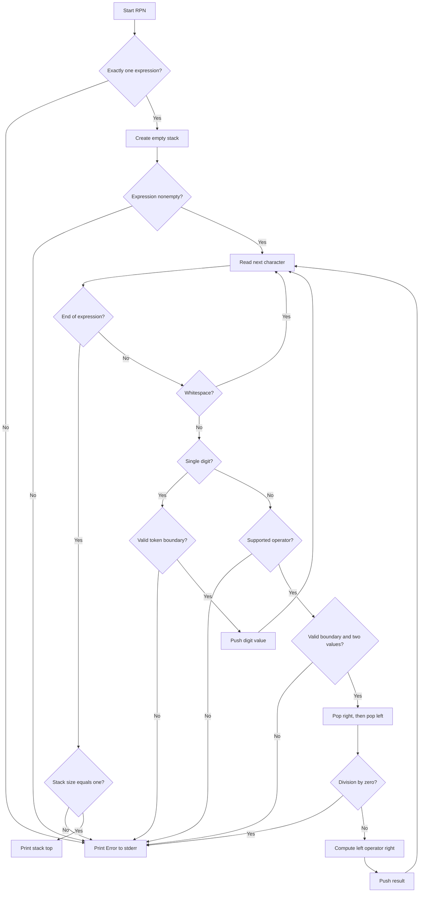

# RPN — Reverse Polish Notation (C++ Module 09, ex01)

## Detailed Development Blueprint — C++98, no source code

## 1. Project mission

Build an executable named `RPN` that accepts exactly one Reverse Polish
Notation expression as one command-line argument, evaluates it, and prints the
integer result.

Example expression:

```text
"8 9 * 9 - 9 - 9 - 4 - 1 +"
```

Operands are single decimal digits (`0` through `9`). The supported operators
are `+`, `-`, `*`, and `/`. Intermediate and final results are not restricted
to a single digit.

### Mandatory constraints

- Use C++98 only.
- Use `std::stack<int, std::list<int> >` as the evaluation stack.
- Use no other STL container. `std::string` and stream classes are supporting
  library types, not alternative storage containers for the algorithm.
- Do not copy tokens into a vector, deque, map, or another sequence.
- The `RPN` class must use the Orthodox Canonical Form.
- Do not use C++11 syntax or utilities.
- Do not support brackets or decimal operands.
- Send errors to standard error.
- Required files: `Makefile`, `main.cpp`, `RPN.hpp`, and `RPN.cpp`.
- Compile with `c++ -Wall -Wextra -Werror -std=c++98`.

---

## 2. Core mental model

RPN places each operator **after** its two operands:

```text
normal notation:  7 - 2
RPN notation:     7 2 -
```

The stack temporarily stores values whose operators have not yet been seen.
When an operator arrives, the two most recent values are removed, combined,
and the result is pushed back.

```text
INPUT TOKEN        STACK (bottom → top)
    7              [7]
    2              [7, 2]
    -              [5]
```

Operand order is critical. For `7 2 -`, the first popped value is `2` and the
second popped value is `7`; the operation must therefore be `7 - 2`, not
`2 - 7`.

---

## 3. Class architecture

### Persistent state

| Private member | Type | Purpose |
|---|---|---|
| `_operands` | `std::stack<int, std::list<int> >` | Stores operands and intermediate results. This is the sole STL container used by the algorithm. |

### Public methods

| Method | Expected input | Output | Exact purpose |
|---|---|---|---|
| `RPN()` | None | Constructed object | Creates an evaluator with an empty stack. |
| `RPN(const RPN &other)` | Another evaluator | Constructed copy | Copies the complete stack state from `other`. Required by OCF. |
| `operator=(const RPN &other)` | Another evaluator | Reference to current object | Checks self-assignment, then copies the stack. Required by OCF. |
| `~RPN()` | None | None | Performs normal cleanup. The stack and list manage their own elements. |
| `calculate(const std::string &expression)` | Entire expression from `argv[1]` | `int`, or a result exposed through a clearly documented alternative | Resets/prepares evaluation state, validates and processes the expression character by character, verifies the final stack invariant, and returns the result. |

### Private helper methods

| Method | Expected input | Output | Exact purpose |
|---|---|---|---|
| `isOperator(char token) const` | One character | `bool` | Returns true only for `+`, `-`, `*`, or `/`. |
| `isOperand(char token) const` | One character | `bool` | Returns true only for ASCII digits `0` through `9`. |
| `isWhitespace(char token) const` | One character | `bool` | Defines which separators are accepted. A strict design can accept ordinary spaces only; a documented whitespace policy may also accept tabs. |
| `performOperation(char operation)` | A validated operator | `void`, or a status/exception on failure | Ensures two operands exist, pops them in correct order, checks division by zero, computes the result, and pushes it back. |
| `apply(int left, int right, char operation) const` | Ordered operands and operator | `int` | Performs exactly one arithmetic operation after validation. Keeping arithmetic separate makes operand order easy to test. |
| `clearStack()` | None | `void` | Removes any remaining elements before a new calculation or after a failed calculation if the same object may be reused. |

### Recommended responsibility split

```text
main()
├── validates argc
├── constructs RPN
├── calls calculate(argv[1])
├── prints successful result to stdout
└── catches/reports failure to stderr

RPN::calculate()
├── owns expression grammar
├── scans one character at a time
├── pushes digit values
├── delegates operators to performOperation()
└── enforces final stack size == 1

RPN::performOperation()
├── enforces stack size >= 2
├── preserves left/right operand order
├── prevents division by zero
└── pushes the intermediate result
```

Fatal evaluation errors may be represented with a single internal exception
type or a consistent boolean/status design. Do not mix several incompatible
error-reporting strategies. The public behavior can simply print `Error`.

---

## 4. Complete state-by-state execution trace

```text
USER RUNS PROGRAM
      │
      │  ./RPN "5 2 - 3 *"
      ▼
┌──────────────────────────────────────────────────────────────┐
│  STATE: PROGRAM START                                        │
│                                                              │
│  argc       = unknown                                        │
│  expression = not selected                                   │
│  stack      = empty                                          │
└─────────────────────────────┬────────────────────────────────┘
                              │
                              ▼
                       validate argc
                       ├── argc < 2?  → Error + stop
                       ├── argc > 2?  → Error + stop
                       └── argc == 2  → expression accepted
                              │
                              ▼
┌──────────────────────────────────────────────────────────────┐
│  STATE: EXPRESSION ACCEPTED                                  │
│                                                              │
│  expression = "5 2 - 3 *"                                   │
│  index      = 0                                              │
│  stack      = []                                             │
└─────────────────────────────┬────────────────────────────────┘
                              │
                              │ construct RPN evaluator
                              ▼
                       calculate(expression)
                       ├── empty expression? → Error
                       └── otherwise         → start scan
                              │
                              ▼
                  ┌─────────────────────────────┐
                  │ READ expression[index]      │◄──────────────┐
                  └──────────────┬──────────────┘               │
                                 │                              │
                                 ▼                              │
                        end of string reached?                  │
                        ├── yes → final validation              │
                        └── no  → classify character            │
                                 │                              │
              ┌──────────────────┼──────────────────┐           │
              │                  │                  │           │
              ▼                  ▼                  ▼           │
         WHITESPACE            DIGIT             OPERATOR       │
         skip it               push it           evaluate it    │
              │                  │                  │           │
              └──────────────────┴──────────────────┘           │
                                 │                              │
                                 ▼                              │
                           increment index                      │
                                 │                              │
                                 └──────────────────────────────┘
```

That high-level picture needs one additional grammar rule: valid tokens must be
separated. Without it, a naïve character scanner would treat `12` as operands
`1` and `2`, even though the user wrote a forbidden multi-digit operand.

```text
AFTER CLASSIFYING A DIGIT OR OPERATOR
              │
              ▼
is the next character end-of-string or accepted whitespace?
├── no  → tokens are touching: "12", "2+", "*3" → Error
└── yes → token boundary is valid → continue
```

---

## 5. Mermaid execution flow



---

## 6. Character-level grammar

### Accepted token types

| Token | Valid examples | Meaning |
|---|---|---|
| Operand | `0`, `1`, ..., `9` | Push its integer value. |
| Operator | `+`, `-`, `*`, `/` | Consume two stack values and push one result. |
| Separator | Space, or the precisely documented whitespace set | Separates tokens and performs no stack action. |

### Expression grammar invariants

1. The expression must contain at least one non-whitespace token.
2. Every non-whitespace character must be a single digit or supported operator.
3. Adjacent non-whitespace characters are invalid. This rejects multi-digit
   operands and joined tokens.
4. An operator is valid only when at least two values are already on the stack.
5. Division is valid only when the right operand is not zero.
6. After all tokens, exactly one value must remain.

### Why token boundaries matter

```text
INPUT       NAÏVE CHARACTER VIEW       CORRECT RESULT

"1 2 +"     1, 2, +                    valid
"12 +"      1, 2, +                    invalid: 12 is multi-digit
"2+"        2, +                       invalid: missing separator
"2 a +"     2, a, +                    invalid: unknown token
"(1 1 +)"   (, 1, 1, +, )             invalid: brackets unsupported
"1.5 2 +"   1, ., 5, 2, +             invalid: decimals unsupported
```

---

## 7. Operator algorithm

### Theoretical steps

When an operator is encountered:

1. Confirm it belongs to `+ - * /`.
2. Check that the stack contains at least two elements.
3. Read the stack top into `right`.
4. Pop the top element.
5. Read the new stack top into `left`.
6. Pop the second element.
7. If the operator is `/`, reject when `right` is zero.
8. Calculate `left operator right`.
9. Push the calculated result.
10. Continue scanning the expression.

### Why the first pop is the right operand

```text
EXPRESSION: 8 3 -

after reading 8:             after reading 3:
┌─────────────┐              ┌─────────────┐
│      8      │ top          │      3      │ top  ← first pop = right
└─────────────┘              ├─────────────┤
                             │      8      │      ← second pop = left
                             └─────────────┘

operator '-' arrives
├── right = 3
├── left  = 8
├── result = left - right
└── result = 8 - 3 = 5

after pushing result:
┌─────────────┐
│      5      │ top
└─────────────┘
```

Reversing the pop roles would produce `3 - 8`, which is wrong. The same issue
is visible with division: `8 2 /` must become `8 / 2`, not `2 / 8`.

### State transition caused by an operator

```text
BEFORE OPERATOR
stack size = N
[..., left, right]
          │
          │ pop right
          │ pop left
          │ calculate
          │ push result
          ▼
AFTER OPERATOR
stack size = N - 1
[..., result]
```

Every number increases stack size by one. Every valid operator decreases it by
one because two values disappear and one result replaces them.

---

## 8. Full worked trace

Expression: `5 2 - 3 *`

```text
READ '5'
├── digit? yes
├── value = 5
└── push

┌──────────────────────────────┐
│ STATE: AFTER TOKEN 5         │
│ stack: [5]                   │
└──────────────┬───────────────┘
               │
               ▼
READ '2'
├── digit? yes
├── value = 2
└── push

┌──────────────────────────────┐
│ STATE: AFTER TOKEN 2         │
│ stack: [5, 2]                │
│              top ────────▲   │
└──────────────┬───────────────┘
               │
               ▼
READ '-'
├── operator? yes
├── stack size >= 2? yes
├── right = pop() → 2
├── left  = pop() → 5
├── calculate 5 - 2 → 3
└── push 3

┌──────────────────────────────┐
│ STATE: AFTER TOKEN -         │
│ stack: [3]                   │
└──────────────┬───────────────┘
               │
               ▼
READ '3'
├── digit? yes
├── value = 3
└── push

┌──────────────────────────────┐
│ STATE: AFTER TOKEN 3         │
│ stack: [3, 3]                │
└──────────────┬───────────────┘
               │
               ▼
READ '*'
├── operator? yes
├── right = pop() → 3
├── left  = pop() → 3
├── calculate 3 * 3 → 9
└── push 9

┌──────────────────────────────┐
│ STATE: END OF EXPRESSION     │
│ stack size = 1               │
│ stack top  = 9               │
│ result     = VALID           │
└──────────────┬───────────────┘
               │
               ▼
          print 9 to stdout
```

---

## 9. Validation and error-handling decision tree

```text
TOKEN / FINAL STATE
       │
       ├── invalid character
       │     examples: a, (, ), ., %, _
       │     └── Error
       │
       ├── touching tokens
       │     examples: 12, 2+, *3
       │     └── Error
       │
       ├── operator with stack size < 2
       │     examples: "+", "1 +", "1 2 + *"
       │     └── Error
       │
       ├── division where right operand == 0
       │     examples: "8 0 /", "8 2 2 - /"
       │     └── Error
       │
       └── end of expression
             ├── stack size == 0 → Error: no result
             ├── stack size > 1  → Error: unused operands
             └── stack size == 1 → valid result
```

### Exact checks in processing order

1. **Argument count:** accept exactly one expression argument.
2. **Empty expression:** reject an empty or whitespace-only expression.
3. **Character classification:** each character must be accepted whitespace, a
   digit, or one of the four operators.
4. **Token boundary:** after a digit or operator, the following character must
   be whitespace or end-of-string.
5. **Operand rule:** digits convert by their character value; no general
   multi-digit parser is required.
6. **Operator arity:** stack size must be at least two before accessing `top()`.
7. **Operand order:** pop right first and left second.
8. **Division by zero:** examine the right operand before division.
9. **Final cardinality:** accept only one remaining stack element.
10. **Output channel:** result to standard output; errors to standard error.

### Avoiding damaged object state after errors

If `performOperation()` pops operands before discovering an error, the internal
stack may become partially modified. The safest evaluation order is:

```text
check stack size
      │
read right and left in a controlled order
      │
validate operation, especially division by zero
      │
only then commit the resulting stack transition
```

Alternatively, if the evaluator stops immediately on any error, make sure
`calculate()` clears the stack before it can be reused. Document which guarantee
your class provides.

---

## 10. Error examples

| Expression | Why invalid |
|---|---|
| `""` | No expression. |
| `"   "` | No operand after ignoring separators. |
| `"+"` | Operator has zero operands. |
| `"1 +"` | Operator has only one operand. |
| `"1 2"` | Two values remain at the end. |
| `"1 2 + 3"` | Two values remain after processing. |
| `"1 2 + +"` | Final operator has only one operand. |
| `"8 0 /"` | Division by zero. |
| `"8 2 2 - /"` | The subexpression `2 2 -` produces zero, then division uses it as the right operand. |
| `"12 3 +"` | Multi-digit input operand is outside the subject grammar. |
| `"1.5 2 +"` | Decimal operands are not required. |
| `"(1 1 +)"` | Parentheses are not supported. |
| `"1 a +"` | Unknown character. |
| `"2 3 %"` | Unsupported operator. |

You may expose all failures simply as `Error`, matching the subject. Internally,
keeping distinct failure reasons makes debugging and testing much easier.

---

## 11. Orthodox Canonical Form

```text
RPN OBJECT LIFECYCLE

default constructor
└── creates empty _operands

copy constructor
└── creates a new stack with the same values and ordering

copy-assignment operator
├── checks whether source and destination are the same object
└── copies stack state when they differ

destructor
└── allows stack/list destructors to release their elements
```

Although this class owns no raw memory, OCF is still mandatory. The underlying
stack adapter supports value copying, so copy behavior should preserve the
entire logical stack.

Decide whether copying an evaluator’s temporary calculation state is meaningful.
For the module requirement, implement the required copy semantics correctly and
be able to explain them during evaluation.

---

## 12. File architecture

```text
ex01/
├── Makefile
│   ├── NAME = RPN
│   ├── required compiler and flags
│   ├── no relinking
│   └── all, clean, fclean, re
│
├── main.cpp
│   ├── argument-count check
│   ├── RPN construction
│   ├── calculate call
│   ├── successful output
│   └── top-level error reporting
│
├── RPN.hpp
│   ├── include guard
│   ├── required independent includes
│   ├── class declaration
│   ├── OCF declarations
│   └── method declarations only
│
└── RPN.cpp
    ├── OCF definitions
    ├── character classification
    ├── expression scan
    ├── stack algorithm
    └── arithmetic/error handling
```

Do not place non-template method implementations in the header.

---

## 13. Suggested development order

1. Create the four required files and a strict C++98 Makefile.
2. Declare the `RPN` class and its exact stack type.
3. Implement all four OCF members.
4. Implement and test `isOperand`, `isOperator`, and the whitespace policy.
5. Define the token-boundary rule before implementing the scan.
6. Implement the character-by-character loop for operands only.
7. Implement operator arity checks and correct pop order.
8. Implement the four arithmetic operations and division-by-zero check.
9. Enforce final stack size of exactly one.
10. Add top-level error reporting to standard error.
11. Test valid expressions, then every malformed category.
12. Compile with warnings as errors and explicitly with `-std=c++98`.

---

## 14. Test matrix

### Valid basics

| Expression | Expected result |
|---|---:|
| `0` | 0 |
| `9` | 9 |
| `1 2 +` | 3 |
| `8 3 -` | 5 |
| `3 4 *` | 12 |
| `8 2 /` | 4 |

### Operand-order tests

| Expression | Expected result | What it proves |
|---|---:|---|
| `8 3 -` | 5 | Left/right subtraction order. |
| `8 2 /` | 4 | Left/right division order. |
| `2 8 -` | -6 | Negative intermediate/final results work. |

### Nested RPN structure

| Expression | Expected result |
|---|---:|
| `5 2 - 3 *` | 9 |
| `2 3 4 * +` | 14 |
| `2 3 + 4 *` | 20 |
| `8 9 * 9 - 9 - 9 - 4 - 1 +` | 42 |

### Invalid structure

- No argument and multiple expression arguments.
- Empty and whitespace-only strings.
- Operator before operands.
- Operator with only one available operand.
- No operators with several operands.
- Too few operators, too many operators, or trailing operator.
- Unsupported character/operator, parentheses, decimals, and multi-digit input.
- Division by literal zero and by a computed zero.

---

## 15. Peer-evaluation readiness

Be ready to explain:

- Why a stack matches RPN’s last-in, first-out evaluation order.
- Why `std::list<int>` was chosen as the explicit stack backing container.
- Why no other STL container is used.
- Why the first popped element is the right operand.
- Why subtraction and division reveal operand-order bugs.
- Why an operator requires two elements before either `top()` or `pop()` is used.
- Why division checks the right operand.
- Why final stack size must equal exactly one.
- How adjacent-character validation prevents `12` from becoming two operands.
- How errors reach standard error and terminate evaluation cleanly.
- How all four OCF methods treat the stack member.
- Why the program is valid C++98 and contains no implementation in the header.

## Final invariant

At every point during a valid scan, `_operands` contains exactly the unresolved
values produced by the expression prefix already processed. At successful end
of input, all operations must have reduced those unresolved values to exactly
one element—the expression’s final result.
