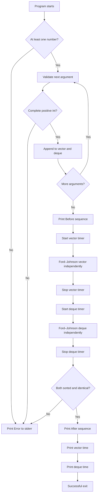

# PmergeMe — Ford–Johnson Merge-Insertion Sort

## Detailed Development Blueprint — C++98, no source code

## 1. Mission and constraints

Build an executable named `PmergeMe` that:

1. Accepts a sequence of positive integers as separate command-line arguments.
2. Rejects malformed or out-of-range input.
3. Stores the same input independently in `std::vector<int>` and
   `std::deque<int>`.
4. Sorts each container independently with Ford–Johnson merge-insertion sort.
5. Displays the sequence before and after sorting.
6. Displays separate processing times for the vector and deque paths.
7. Handles at least 3000 integers.

Mandatory design constraints:

- C++98 only.
- At least two different STL containers: `std::vector<int>` and
  `std::deque<int>`.
- No modern type inference, lambdas, range-based loops, `chrono`, `stoi`, or
  variadic templates.
- `PmergeMe` follows the Orthodox Canonical Form.
- Required files: `Makefile`, `main.cpp`, `PmergeMe.hpp`, `PmergeMe.cpp`, and,
  if templates are used, a template implementation file such as
  `PmergeMe.tpp` included from the header.
- Compilation: `c++ -Wall -Wextra -Werror -std=c++98`.
- Errors go to standard error.

### Important subject-versus-design note

The subject strongly advises implementing the algorithm separately for each
container. Your requested architecture uses a shared template to avoid copying
the logic. This is technically valid if:

- the template is instantiated independently for vector and deque;
- each run owns its own state and auxiliary sequences;
- the deque run never performs its algorithm through a vector;
- the vector and deque are timed separately;
- you can explain how iterator invalidation and insertion cost differ.

For maximum evaluator safety, keep thin, visibly separate `sortVector()` and
`sortDeque()` entry points. They may call the same carefully designed template
core, but the two container paths, timers, and results remain explicit.

---

## 2. High-level architecture

```text
COMMAND-LINE ARGUMENTS
          │
          ▼
┌──────────────────────────────────────────────────────────────┐
│  PARSE ONCE, STORE TWICE                                     │
│                                                              │
│  _vectorData : std::vector<int>                              │
│  _dequeData  : std::deque<int>                               │
│                                                              │
│  Both contain the same values in the same original order.    │
└─────────────────────────────┬────────────────────────────────┘
                              │
                 ┌────────────┴────────────┐
                 │                         │
                 ▼                         ▼
       VECTOR PROCESSING PATH     DEQUE PROCESSING PATH
       ├── start timer             ├── start timer
       ├── Ford–Johnson            ├── Ford–Johnson
       ├── stop timer              ├── stop timer
       └── verify sorted           └── verify sorted
                 │                         │
                 └────────────┬────────────┘
                              │
                              ▼
                      compare results
                      ├── same size?
                      ├── same values?
                      └── both sorted?
                              │
                              ▼
                    print Before / After / times
```

---

## 3. Class architecture

### Suggested private data

| Member | Type | Purpose |
|---|---|---|
| `_vectorData` | `std::vector<int>` | Vector copy of the original sequence; later becomes its independently sorted result. |
| `_dequeData` | `std::deque<int>` | Deque copy of exactly the same original sequence; later becomes its independently sorted result. |
| `_vectorTimeUs` | `double` | Measured vector processing time in microseconds. |
| `_dequeTimeUs` | `double` | Measured deque processing time in microseconds. |

You may keep timing values local instead of members. If they are members, OCF
copy and assignment must copy them consistently.

### Public interface

| Method | Input | Output | Exact responsibility |
|---|---|---|---|
| `PmergeMe()` | None | Constructed object | Creates empty vector/deque state and zeroed timing state. |
| `PmergeMe(const PmergeMe &other)` | Another object | Constructed copy | Copies both containers and timing state. |
| `operator=(const PmergeMe &other)` | Another object | Reference to current object | Handles self-assignment and copies all members. |
| `~PmergeMe()` | None | None | Allows both containers to clean themselves up. |
| `parseArguments(int argc, char **argv)` | Full CLI argument set | `void`, `bool`, or exception-based success/failure | Validates every token and appends each accepted integer to both containers in identical order. Parsing must be transactional or leave a clearly unusable object on failure. |
| `execute()` | Previously parsed object state | `void` | Prints the original order, runs and times both independent sorts, verifies results, and prints final output. |

### Parsing and orchestration helpers

| Method | Input | Output | Exact responsibility |
|---|---|---|---|
| `parsePositiveInt(const std::string &token, int &value) const` | One argument and output reference | `bool` | Accepts only a complete positive decimal integer representable by `int`; rejects signs according to policy, zero, garbage, and overflow. |
| `sortVector()` | Vector member | `void` | Times only the vector processing path and invokes the template core for vector. |
| `sortDeque()` | Deque member | `void` | Times only the deque processing path and invokes the template core for deque. |
| `printBefore() const` | Original data | `void` | Prints `Before:` followed by the unsorted sequence. Call before either member is mutated, or retain a deliberate original view. |
| `printAfter() const` | Sorted data | `void` | Prints `After:` followed by one verified sorted result, normally vector. |
| `printTimings() const` | Count and stored times | `void` | Prints one explicit line for vector and one for deque, with units and adequate precision. |
| `verifyResults() const` | Both sorted members | `bool` | Confirms nondecreasing order and element-for-element equality of vector and deque outputs. This is a diagnostic safety net, not a replacement for the algorithm. |
| `nowMicroseconds() const` | None | `double` or integer-compatible timestamp representation | Obtains a C++98-compatible timestamp suitable for elapsed-time subtraction. |

### Template algorithm helpers

The exact signatures depend on whether you implement Ford–Johnson using
individual elements, pair records, or recursive element groups. The following
table describes responsibilities rather than source syntax.

| Template/helper | Input | Output | Exact responsibility |
|---|---|---|---|
| `fordJohnson(Container &sequence)` | Vector or deque sequence | In-place sorted sequence | Public algorithm core: handles base case, pairing, recursive maxima ordering, main-chain construction, Jacobsthal insertion, and odd element. |
| `normalizePairs(Container &sequence, groupSize)` | Current recursion level | Paired/grouped sequence | Compares each adjacent pair of elements or groups and places the smaller unit before the larger unit while preserving pair identity. |
| `sortLargerChain(Container &sequence, groupSize)` | Normalized pairs/groups | Recursively ordered maxima/groups | Recursively sorts the larger member from every pair without losing its associated smaller partner. |
| `buildMainChain(...)` | Ordered pairs | Main chain plus pending elements | Starts the chain with the special first small element and all sorted large elements; records every remaining small element with its partner bound. |
| `buildJacobsthalOrder(count, OrderContainer &order)` | Number of pending insertions | Index order | Produces insertion indices in Jacobsthal batches without duplicates or out-of-range positions. The auxiliary order must use the current container family if strict independence is required. |
| `boundedLowerBound(chain, value, upperBound)` | Main chain, pending value, partner boundary | Insertion position | Performs binary search only in the legal prefix ending before the pending element’s associated large partner. |
| `insertPending(...)` | Main chain, pending sequence, Jacobsthal order | Expanded sorted chain | Inserts pending small elements in the comparison-efficient order and updates partner positions safely after insertions. |
| `isSorted(const Container &sequence) const` | Vector or deque | `bool` | Verifies nondecreasing order without using a third container. |

### Template placement rule

C++98 templates normally need their definitions visible at the point of
instantiation. Therefore:

```text
PmergeMe.hpp
├── class declaration
├── template declarations
└── includes PmergeMe.tpp at the end

PmergeMe.tpp
└── template definitions only
```

This does not violate the Module rule against ordinary implementations in a
header: function templates are the stated exception. Keep non-template method
definitions in `PmergeMe.cpp`.

---

## 4. Ford–Johnson vocabulary

Given each normalized pair:

```text
(small, large) = (bᵢ, aᵢ), where bᵢ <= aᵢ
```

| Term | Meaning |
|---|---|
| Pair | Two adjacent input elements, or two adjacent groups at a deeper recursive level. |
| `aᵢ` | Larger member of pair `i`; it belongs to the recursively sorted maxima chain. |
| `bᵢ` | Smaller member associated with `aᵢ`; it waits for later insertion. |
| Main chain | Initially `b₁` followed by all sorted `a` elements. It remains sorted. |
| Pending chain | Remaining `b` elements awaiting insertion, plus possibly an unpaired straggler. |
| Partner bound | The position of `aᵢ`; because `bᵢ <= aᵢ`, `bᵢ` only needs searching before `aᵢ`. |
| Straggler | Final unpaired item when the input/group count is odd. It has no paired upper bound. |
| Jacobsthal order | The schedule controlling which pending `b` is inserted next. |

Never sort the `a` values while forgetting which `b` belongs to each `a`.
Pair association is a central invariant of the algorithm.

---

## 5. Ford–Johnson theoretical breakdown

### Phase 1 — pair adjacent values

Example input:

```text
7  3    9  2    6  5    4
└─pair─┘ └─pair─┘ └─pair─┘  └─straggler
```

Compare within each complete pair and normalize it:

```text
(3,7)   (2,9)   (5,6)   straggler = 4
 b₁ a₁   b₂ a₂   b₃ a₃
```

This phase guarantees only `bᵢ <= aᵢ`. The pairs are not globally ordered yet.

```text
INPUT LEVEL
     │
     ▼
split into adjacent pairs
├── compare two members
├── smaller becomes bᵢ
├── larger becomes aᵢ
└── save an odd final unit as straggler
```

### Phase 2 — recursively sort the larger members

Collect the conceptual maxima:

```text
a chain before recursion: 7  9  6
```

Apply Ford–Johnson recursively to that chain until a level has zero or one
sortable unit. After recursion:

```text
sorted maxima: 6  7  9
```

The associated pairs must be reordered with those maxima:

```text
(5,6)   (3,7)   (2,9)
 b₁ a₁   b₂ a₂   b₃ a₃
```

The subscripts are now assigned by the maxima’s sorted order, not necessarily
by their original input positions.

### Phase 3 — build the initial main chain

Because `b₁ <= a₁` and all maxima are ordered:

```text
MAIN CHAIN:    b₁  a₁  a₂  a₃
               5   6   7   9

PENDING:       b₂  b₃  straggler
               3   2      4
```

`b₁` is placed directly at the beginning. It does not need a general binary
insertion search.

### Phase 4 — generate Jacobsthal insertion order

Jacobsthal numbers follow:

```text
J(0) = 0
J(1) = 1
J(n) = J(n - 1) + 2 × J(n - 2)

sequence: 0, 1, 1, 3, 5, 11, 21, 43, ...
```

For Ford–Johnson, do not simply insert elements at indices equal to Jacobsthal
numbers. Use successive Jacobsthal boundaries to create **descending batches**.

With pending elements conceptually numbered `b₂, b₃, b₄, ...`, the familiar
order begins:

```text
b₃, b₂, b₅, b₄, b₁₁, b₁₀, b₉, b₈, b₇, b₆, ...
```

The batch boundaries are 3, 5, 11, 21, ...; inside each newly opened interval,
visit indices backward.

```text
boundary 3:       b₃, b₂
boundary 5:       b₅, b₄
boundary 11:      b₁₁, b₁₀, b₉, b₈, b₇, b₆
```

Stop each batch at the actual pending count. Never generate index zero,
duplicate an index, or access beyond the pending sequence.

Why this order exists: it keeps many binary-search ranges near sizes
`2^k - 1`, where a worst-case binary search has a uniform comparison depth.

### Phase 5 — bounded binary insertion

For each `bᵢ` selected by the Jacobsthal schedule:

1. Find the current position of its paired `aᵢ` in the main chain.
2. Search only from the beginning of the main chain up to—but not including—the
   partner `aᵢ`.
3. Insert `bᵢ` at the lower-bound position found in that prefix.
4. Update any stored positions/iterators invalidated by the insertion.

```text
main chain before inserting b₃:

[ b₁ | a₁ | a₂ | a₃ | a₄ ... ]
                    ▲
                    │ partner of b₃

legal search range for b₃:
[ b₁ | a₁ | a₂ ]
└──── search ──────┘

do not search after a₃ because b₃ <= a₃ is already known
```

For a straggler, there is no associated `aᵢ`, so its legal search range is the
whole current main chain. Insert it according to the consistent end-of-pending
policy in your implementation.

### Phase 6 — finish and copy back

After every pending element and any straggler has been inserted:

```text
main chain size == original sequence size
main chain is nondecreasing
main chain contains every original occurrence exactly once
```

Move/copy this logical chain back into the active vector or deque instance.

---

## 6. Why the algorithm must work with groups

A shallow “make pairs, sort maxima with some other sort, insert minima” design
is not a complete Ford–Johnson implementation. The maxima must themselves be
sorted recursively by merge-insertion.

At recursion depth `d`, one logical sortable unit represents a contiguous group
of original elements:

```text
depth 0: group size 1   [x]
depth 1: group size 2   [x x]
depth 2: group size 4   [x x x x]
depth 3: group size 8   [x x x x x x x x]
```

The comparison key for a group is its designated maximum (commonly the final
element after group normalization). Swapping or moving groups must move the
whole block, not just the comparison key.

```text
RECURSIVE LEVEL WITH GROUP SIZE g
              │
              ▼
can two complete groups of size g be paired?
├── no  → return from this recursion level
└── yes
     │
     ▼
compare group maxima
     │
     ▼
normalize each adjacent group pair
     │
     ▼
recurse with group size 2g
     │
     ▼
build main/pending chains of size-g groups
     │
     ▼
Jacobsthal-insert pending groups
```

This group view preserves pair associations naturally and prevents a common
mistake where recursively sorted maxima become disconnected from their minima.

---

## 7. Full miniature walkthrough

Use the odd-sized input:

```text
7 3 9 2 6 5 4
```

### State A — pair normalization

```text
raw pairs:          (7,3)   (9,2)   (6,5)    [4]
normalized:         (3,7)   (2,9)   (5,6)    [4]
                     b  a     b  a     b  a    odd
```

### State B — maxima recursion

```text
maxima before:       7 9 6
maxima after:        6 7 9

pairs reordered:    (5,6)   (3,7)   (2,9)
                     b₁a₁     b₂a₂     b₃a₃
```

### State C — initial chains

```text
main:       [5, 6, 7, 9]
pending:    [b₂=3, b₃=2, odd=4]
```

### State D — Jacobsthal insertion

For the paired pending elements, the first batch selects `b₃` then `b₂`.

```text
insert b₃ = 2
├── partner a₃ = 9
├── search prefix before 9
└── main becomes [2, 5, 6, 7, 9]

insert b₂ = 3
├── partner a₂ = 7
├── search prefix before 7
└── main becomes [2, 3, 5, 6, 7, 9]

insert odd = 4
├── no partner bound
├── search complete chain
└── main becomes [2, 3, 4, 5, 6, 7, 9]
```

### State E — final invariants

```text
┌──────────────────────────────────────────────────────────────┐
│  STATE: SORT COMPLETE                                        │
│                                                              │
│  original size = 7                                           │
│  sorted size   = 7                                           │
│  result        = 2 3 4 5 6 7 9                              │
│  nondecreasing = true                                        │
└──────────────────────────────────────────────────────────────┘
```

The example communicates the top-level idea. Your actual implementation must
apply the same process recursively to groups, not replace maxima recursion with
`std::sort`.

---

## 8. Complete program execution flow



### State-by-state lifecycle

```text
./PmergeMe 3 5 9 7 4
          │
          ▼
validate argv[1..argc-1]
├── full decimal token?
├── strictly positive?
├── <= INT_MAX?
└── duplicate policy satisfied?
          │
          ▼
┌──────────────────────────────────────────────────────────────┐
│  STATE: PARSED                                               │
│                                                              │
│  _vectorData = [3, 5, 9, 7, 4]                              │
│  _dequeData  = [3, 5, 9, 7, 4]                              │
│  equal input  = true                                         │
└─────────────────────────────┬────────────────────────────────┘
                              │
                              ▼
                  print Before: 3 5 9 7 4
                              │
                              ▼
                       VECTOR TIMER START
                              │
                              ▼
                 fordJohnson(_vectorData)
                 ├── pair/group normalization
                 ├── recursive maxima sort
                 ├── main/pending construction
                 ├── Jacobsthal order
                 └── bounded insertions
                              │
                              ▼
                       VECTOR TIMER STOP
                              │
                              ▼
┌──────────────────────────────────────────────────────────────┐
│  STATE: VECTOR COMPLETE                                      │
│                                                              │
│  _vectorData  = [3, 4, 5, 7, 9]                             │
│  _vectorTimeUs = measured duration                           │
│  _dequeData   = [3, 5, 9, 7, 4]  ← still unsorted           │
└─────────────────────────────┬────────────────────────────────┘
                              │
                              ▼
                        DEQUE TIMER START
                              │
                              ▼
                  fordJohnson(_dequeData)
                              │
                              ▼
                        DEQUE TIMER STOP
                              │
                              ▼
┌──────────────────────────────────────────────────────────────┐
│  STATE: BOTH COMPLETE                                        │
│                                                              │
│  vector = [3, 4, 5, 7, 9]                                  │
│  deque  = [3, 4, 5, 7, 9]                                  │
│  same result = true                                          │
│  both sorted = true                                          │
└─────────────────────────────┬────────────────────────────────┘
                              │
                              ▼
                  print After + two timing lines
```

---

## 9. Parsing requirements

Validate every command-line argument completely before treating it as an
integer.

```text
ARGUMENT TOKEN
      │
      ▼
empty string?
├── yes → Error
└── no
     │
     ▼
every character is a decimal digit?
├── no  → Error
└── yes
     │
     ▼
conversion overflows int?
├── yes → Error
└── no
     │
     ▼
converted value <= 0?
├── yes → Error
└── no
     │
     ▼
append same value to vector and deque
```

### Exact parsing checklist

- Require at least one numeric argument.
- Reject empty tokens.
- Reject negative numbers.
- Reject zero because the subject asks for positive integers.
- Decide whether leading `+` is accepted; strict digit-only input rejects it.
- Reject decimal points, exponent notation, signs in the middle, and alphabetic
  suffixes.
- Reject values larger than `INT_MAX` before narrowing to `int`.
- Confirm the entire argument was consumed, not just a numeric prefix.
- Apply one documented duplicate policy. The subject explicitly leaves duplicate
  handling to your discretion. Accepting duplicates is natural for a sorting
  algorithm; rejecting them is also allowed if consistently reported.
- Do not impose a small upper count: the program must handle at least 3000.
- If parsing fails midway, do not continue to timing with partially populated
  containers.

### Safe C++98 conversion concept

`std::atoi` alone is too weak because it cannot distinguish all malformed and
overflow cases. A stream-based full-token parse or careful digit-by-digit
accumulation can enforce the complete grammar. When accumulating manually,
check whether adding the next digit would exceed `INT_MAX` **before** performing
the multiplication/addition.

---

## 10. Independent container processing

“Independent” means more than copying the final vector result into the deque.

```text
VALID
├── vector begins with original input
├── deque begins with original input
├── vector runs Ford–Johnson
├── deque runs Ford–Johnson
├── each has its own algorithm state
└── each duration surrounds its own processing path

INVALID COMPARISON
├── sort vector
├── copy sorted vector into deque
└── claim the copy duration is deque sorting time
```

If the template creates auxiliary chains, the vector instantiation should use
vector-family auxiliary storage and the deque instantiation should use
deque-family storage. Otherwise, the timings primarily compare the same hidden
container rather than the two requested implementations.

### Container-specific concerns

| Concern | `std::vector` | `std::deque` |
|---|---|---|
| Random access | Constant time | Constant time |
| Contiguous memory | Yes | No; segmented blocks |
| Middle insertion | Shifts later elements | Still linear, with different movement behavior |
| Iterator invalidation | Insertions can invalidate iterators/references broadly | Insertions also invalidate iterators; do not assume stability |
| Reserve capacity | Available | Not available |

Do not retain iterators across insertions unless the standard guarantees their
validity for that exact operation. A robust blueprint stores logical indices or
recomputes partner locations after insertion.

---

## 11. Time measurement in C++98

The C++98 standard library has no `std::chrono`. In the usual 42 Unix environment,
`gettimeofday()` is a practical wall-clock source with microsecond fields.
Another possible source is `clock()`, but that measures CPU time and its
resolution/meaning differ. Choose one clock and label the result honestly.

### `gettimeofday()` concept

A timestamp contains:

- whole seconds;
- microseconds within the current second.

Conceptually normalize both timestamps to microseconds:

```text
timestamp_us = seconds × 1,000,000 + microseconds
elapsed_us   = end_timestamp_us - start_timestamp_us
```

Use a representation wide enough for timestamp arithmetic. C++98 supports
implementation-provided wide integer types on typical compilers, but strict
portable code can compute the seconds difference and microseconds difference
separately into a `double`. Be able to explain the portability choice.

### What belongs inside the timed interval

The subject says the displayed duration should cover operations including data
management, not only an isolated comparison loop. Define both paths symmetrically.

A defensible policy is:

```text
prepare identical original inputs before timing

start container timer
├── build algorithm-specific auxiliary chains/groups
├── execute all recursive Ford–Johnson work
├── perform all insertions
└── finalize the sorted container representation
stop container timer
```

Do not include printing in either duration because terminal I/O noise can dwarf
the algorithm. Apply the same boundary to vector and deque.

Do not time argument parsing only once and attribute it to one container. If
your interpretation includes container population, populate/treat each path
symmetrically and document the boundary.

### Timing state diagram

```text
vectorStart = now
      │
      ▼
all vector-specific processing
      │
      ▼
vectorEnd = now
      │
      └── vectorTimeUs = vectorEnd - vectorStart

dequeStart = now
      │
      ▼
all deque-specific processing
      │
      ▼
dequeEnd = now
      │
      └── dequeTimeUs = dequeEnd - dequeStart
```

For small inputs, elapsed time may be zero or unstable at the clock’s resolution.
That is not necessarily an algorithm bug. Print enough fractional precision to
make differences visible, as required by the subject.

---

## 12. Strict output contract

Output exactly four logical lines on success:

```text
Before: <original sequence>
After: <sorted sequence>
Time to process a range of <N> elements with std::vector : <time> us
Time to process a range of <N> elements with std::deque : <time> us
```

### Output checklist

- First line begins with explicit text such as `Before:`.
- First line contains the unsorted sequence in original order.
- Second line begins with explicit text such as `After:`.
- Second line contains a nondecreasing sequence.
- Third line names `std::vector` explicitly.
- Fourth line names `std::deque` explicitly.
- Both timing lines show the same element count.
- Both timing lines show a unit, preferably `us` for microseconds.
- Precision is sufficient to reveal differences.
- Every line ends with a newline.
- Successful output goes to standard output.
- Errors go to standard error and do not print misleading timing/results.

Preserve or restore stream formatting if fixed precision could affect later
output. Avoid claiming nanoseconds when the clock and calculation provide only
microseconds.

---

## 13. Algorithm invariants

Check these mentally at every phase:

### Pair invariant

```text
for every complete pair: bᵢ <= aᵢ
```

### Association invariant

```text
when aᵢ moves during recursive sorting, its bᵢ remains associated with it
```

### Main-chain invariant

```text
before and after every insertion, main chain is nondecreasing
```

### Partner-bound invariant

```text
bᵢ is searched only before its current partner aᵢ
```

### Conservation invariant

```text
number of values in main + pending + straggler
equals number of values at this recursion level
```

### Completion invariant

```text
sorted size == input size
sorted multiset == input multiset
vector result == deque result
```

---

## 14. Common incorrect implementations

| Mistake | Why it is wrong |
|---|---|
| Sorting maxima with `std::sort` | Replaces the required recursive Ford–Johnson step. |
| Losing each minimum’s associated maximum | Makes bounded insertion impossible or incorrect. |
| Inserting pending elements sequentially | Misses the Jacobsthal comparison schedule. |
| Using raw Jacobsthal values directly as the entire order | Correct order requires descending batches between boundaries. |
| Searching the whole main chain for every `bᵢ` | Ignores the known bound `bᵢ <= aᵢ` and loses Ford–Johnson’s comparison strategy. |
| Treating the odd item as a normal pair | It has no partner bound. |
| Keeping iterators after insertions | Vector/deque insertion may invalidate them. |
| Sorting vector then copying it into deque | Does not independently execute the algorithm twice. |
| Timing printing | Measures terminal I/O more than the container algorithm. |
| Accepting numeric prefixes such as `12abc` | Argument validation is incomplete. |
| Rejecting negative intermediate concepts | Inputs must be positive, but sorting comparisons themselves do not require arithmetic. |

---

## 15. Suggested development order

1. Build the Makefile and required file structure.
2. Declare the OCF class with vector, deque, and timing state.
3. Implement strict positive-integer parsing and populate both containers.
4. Implement `Before:` and `After:` printing without timing yet.
5. Write a container-independent sortedness verifier.
6. Prototype Ford–Johnson on paper for 2, 3, 4, 5, and 7 elements.
7. Implement pair/group normalization while preserving association.
8. Implement recursive sorting of larger groups.
9. Implement main-chain and pending-chain construction.
10. Generate and test Jacobsthal insertion indices separately.
11. Implement bounded binary insertion and handle iterator invalidation.
12. Add the odd straggler path.
13. Instantiate and test the vector path.
14. Instantiate and test the deque path independently.
15. Verify both outputs are sorted and identical.
16. Add symmetric microsecond timing boundaries.
17. Test with 3000 or more integers and all parsing errors.

---

## 16. Test strategy

### Small structural cases

- One value: base case.
- Two ordered values and two reversed values.
- Three values: one pair plus straggler.
- Four values: two complete pairs.
- Five, seven, and nine values: odd paths at several levels.
- Already sorted input.
- Reverse-sorted input.
- Random input.
- Duplicate values according to your declared policy.

For small cases, draw every pair, main chain, pending chain, Jacobsthal index,
partner bound, and insertion location by hand.

### Parsing failures

- No numeric arguments.
- `0`, negative values, signs-only tokens.
- Decimal and exponent forms.
- Alphabetic suffix/prefix.
- Value greater than `INT_MAX`.
- Embedded whitespace inside one quoted argument.
- Duplicate input if your policy rejects duplicates.

### Scale and comparison

- 3000 random positive integers.
- More than 3000 integers.
- Verify output independently against a trusted sorted copy only in a test
  harness; do not use that trusted sort as the submitted algorithm.
- Confirm vector and deque results match element for element.
- Repeat timings because short wall-clock measurements vary between runs.

---

## 17. Peer-evaluation readiness

Be able to explain:

- Why Ford–Johnson is called merge-insertion sort.
- The roles of `aᵢ`, `bᵢ`, main chain, pending chain, and straggler.
- How pairs are reordered without losing association.
- Why maxima are recursively sorted with Ford–Johnson.
- How group size changes across recursion levels.
- The Jacobsthal recurrence and descending batch order.
- Why `b₃, b₂, b₅, b₄, ...` is different from simple sequential insertion.
- Why insertion search ends before partner `aᵢ`.
- How odd input sizes are handled.
- How iterator invalidation is avoided.
- Why vector and deque processing is genuinely independent.
- What exactly is included in each timer.
- Why the clock and unit are appropriate in C++98.
- How the implementation handles at least 3000 integers.
- How OCF copies both containers and any timing members.

## Final architectural principle

Ford–Johnson is not merely “pair, sort, insert.” Its identity comes from four
linked guarantees: recursively ordered maxima, preserved minimum-to-maximum
pairing, Jacobsthal-ordered pending insertions, and binary searches bounded by
each pending element’s partner. If any one of these is missing, the program may
still sort correctly, but it is no longer a faithful merge-insertion
implementation.
